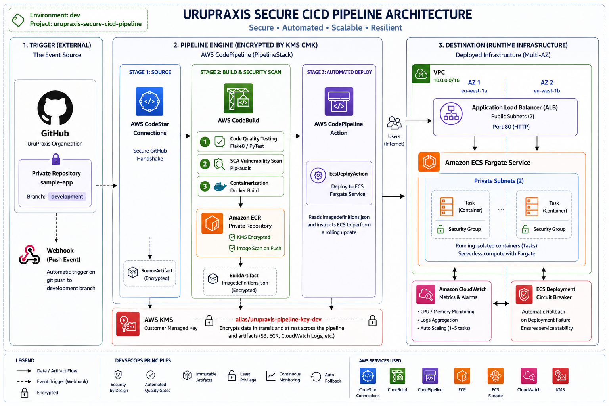

# Secure DevSecOps CI/CD Automation Pipeline Blueprint

A production-ready, highly compliant DevSecOps automated deployment factory engineered using **AWS CDK V2 (Python)**. This architecture orchestrates an isolated, continuous delivery ecosystem driven by a human-readable **TOML configuration engine**, enforcing automated security validation checkpoints, cryptographically protected artifact pipelines, and resilient serverless containers with automated rollback capabilities.

---

## 🏗️ Architecture Overview

The system establishes a modular, decoupled pipeline architecture where the infrastructure-as-code (IaC) lifecycle and application runtime layer are orchestrated as a single logical stack.



### 🚨 Architectural Workflow Breakdown

1. **Source Layer (Secure GitHub Handshake):** Leverages native AWS CodeConnections to establish a cryptographically isolated OAuth link into private GitHub organization repositories. Triggers builds completely via automated event webhooks without hardcoded access tokens or personal PAT keys.
2. **Build & Compliance Layer (Shift-Left Security Gate):** Spawns isolated ephemeral `Amazon Linux` instances via AWS CodeBuild to ingest repository sources. Enforces mandatory static code analysis (`flake8`), software composition analysis (`pip-audit`), and secure container compilation (`Docker Build`).
3. **Container Registry Layer (Hardened ECR):** Pushes immutable Docker images to Amazon Elastic Container Registry (ECR). Enforces native encrypted storage via Customer Managed Keys (CMK) and automated asynchronous image vulnerability scanning upon ingestion (`IMAGE_SCAN_ON_PUSH`).
4. **Runtime & Resilience Layer (Serverless ECS Fargate):** Instructs Amazon ECS Fargate clusters to perform resilient rolling updates backed by an Application Load Balancer (ALB). Implements a deployment circuit breaker coupled with real-time CloudWatch 5XX server-side metrics to execute instant automated rollbacks in case of container runtime failures.

---

## 🔒 Security Hardening Controls

Following the **AWS Well-Architected Security Pillar** and **PCI-DSS / ISO 27001** compliance frameworks, this pipeline implements strict isolation controls:

* **Customer Managed Cryptography (KMS CMK):** All software artifacts in transit, resting S3 pipeline buckets, and ECR container layers are encrypted using a dedicated KMS Key with automated annual rotation actively enabled.
* **Granular Least-Privilege IAM Boundary:** Bypasses framework-generated permission over-provisioning by injecting strict explicit access cross-policies. Grants specialized read boundaries to action engines and native readonly policies (`AmazonEC2ContainerRegistryReadOnly`) to Fargate task execution agents.
* **High Availability Blueprints:** Enforces zero downtime updates by locking task availability constraints (`min_healthy_percent=100`) and provisions responsive Auto-Scaling tracking groups bound between 1 to 5 serverless instances.

---

## 🛠️ Configuration Structure (`config.toml`)

Environment separation and deployment parameters are declared via a decoupled configuration layout, maintaining high-utility reuse across multi-account frameworks.

```toml
[ENV]
ENVIRONMENT = "dev"

[GLOBAL_dev]
ACCOUNT = "537013495754"
REGION = "us-east-2"

[SOURCE_dev]
GITHUB_REPOSITORY = "UruPraxis/sample-app"
GITHUB_BRANCH = "development"

[BUILD_dev]
COMPUTE_TYPE = "SMALL"
IMAGE_SCAN_ON_PUSH = true

[DEPLOY_dev]
CONTAINER_PORT = 80
DESIRED_COUNT = 1
```

---

## 🚀 Execution & Verification Guide

### 1. Project Initialization & Context Synthesis
Activate your virtual environment and synthesize the underlying CloudFormation templates locally:

```bash
# Export the target execution profile
export AWS_PROFILE=devops

# Initialize environment dependencies
source .venv/bin/activate
pip install -r requirements.txt

# Synthesize logical stack structures
CDK_ENV=dev cdk synth
```

### 2. Infrastructure Deployment
Aprovision the automated factory stack straight to your target AWS region:

```bash
# Bootstrap the region environment (Mandatory once per account/region)
CDK_ENV=dev cdk bootstrap

# Deploy the entire secure ecosystem
CDK_ENV=dev cdk deploy --profile devops
```

### 3. Pipeline Activation
* Go to the **AWS CodePipeline** web console.
* Navigate to **Settings ➡️ Connections** and locate your newly provisioned connection.
* Click **Update pending connection** and complete the secure OAuth authorization link to the GitHub Organization.
* Perform a `git push` on your application repository branch to trigger the production-grade automation loop.

---

## Developed by UruPraxis Cloud Solutions
Engineering robust, secure, and automated cloud fabrics for modern enterprise scaling.
